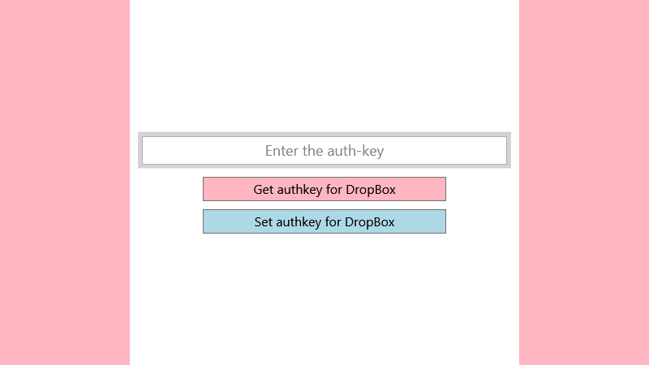
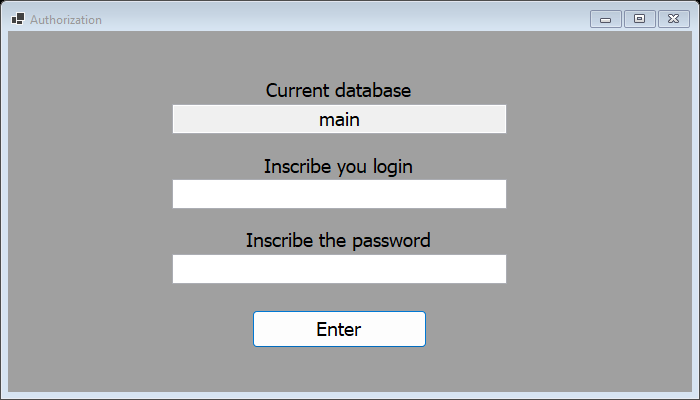
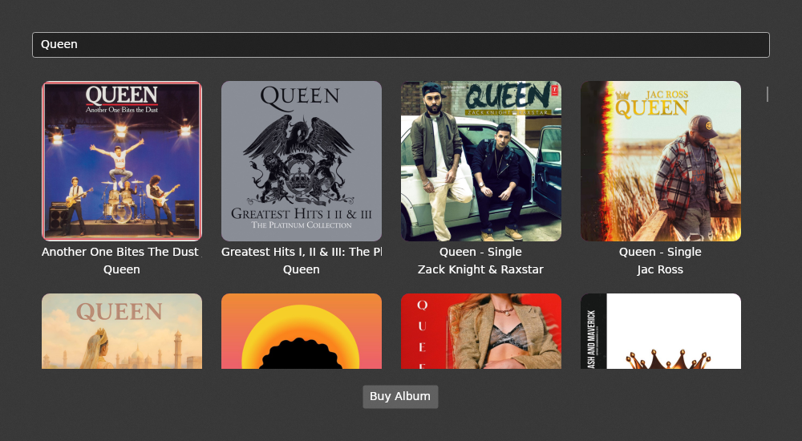

# C# / T-SQL Desktop Development

Merged repository covering C# desktop development work: .NET semester coursework, WinForms/Entity Framework database learning exercises, and an Avalonia MVVM tutorial app. Every sub-project here is archived learning material, not production code. Each sub-project keeps its own git history (see the merge commits in the root log for where each history was grafted in).

## Sub-projects

### [`dotnet-gidsik/`](dotnet-gidsik)
> ⏹️ **Archived Coursework** — university .NET labs

Two semesters of C# .NET coursework:
- [`1-Semester-2023/`](dotnet-gidsik/1-Semester-2023) — 6 console-app labs (OOP, generics, serialization, design patterns, threading)
- [`2-Semester-2024/`](dotnet-gidsik/2-Semester-2024) — 8 WinForms/WPF labs (custom controls, EF Core, DI, MVVM)

See each folder's README for the lab-by-lab index.

*(`2-Semester-2024/lab8`, the last lab in the sequence — a Dropbox file explorer's login screen)*

**Tech stack:** C#, .NET 6.0, WinForms, WPF, EF Core, xUnit

### [`winforms-db-learning/survey-data-manager/`](winforms-db-learning/survey-data-manager)
> ⏹️ **Archived Coursework** — WinForms + database learning

WinForms app for geodetic survey data — `Project`, `Terrain`, `Picket`, `Measurement`, `Equipment`, `Operator`, `Customer`, `Datum`, `User`, `SurveyLine` entities, wired up with `Microsoft.Extensions.DependencyInjection` and EF Core against a self-contained SQLite database (`app.db`, no setup needed to run it). `Entrance` is the login screen, `RecordsForm` is the main CRUD grid, `Analytics` is a read-only summary view. Data access sits behind `IDbWorker`, with `FakeDbWorker`/`RealDbWorker` swappable via DI. See [`winforms-db-learning/`](winforms-db-learning) for the other 3 exercises in this set (two of which need a real SQL Server instance to run).

*(the `Entrance` login screen)*

**Tech stack:** C#, WinForms, EF Core, SQLite, DI

### [`musicstore-avalonia/`](musicstore-avalonia)
> ⏹️ **Archived Coursework** — Avalonia UI tutorial

A desktop music-store app built from the [official Avalonia tutorial](https://docs.avaloniaui.net/docs/tutorials/music-store-app/): searches the iTunes album catalog and displays results with acrylic blurred backgrounds. MVVM architecture (`Models/`, `ViewModels/`, `Views/`).

*(searching "Queen")*

**Tech stack:** C#, Avalonia UI, MVVM

## CI

`.github/workflows/ci.yml` builds every project on every push/PR: portable (net6.0/net8.0, non-Windows) projects on `ubuntu-latest`, WinForms/WPF (`net6.0-windows`) projects on `windows-latest`, and the one legacy .NET Framework 4.8 project (`sql-table-browser`) via classic MSBuild, non-blocking.
