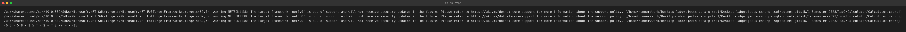

# lab2 — Expression calculator + array statistics

Four projects: `Calculator` (console entry), `Methods` (class library), and `Calculator.Test`/`Methods.Test` (xUnit).

`Calculator` parses and evaluates arithmetic expressions (`+ - * /`, parentheses) via the shunting-yard algorithm — `Dijkstra()` converts infix to postfix, `Decode()` evaluates the postfix expression. `Methods`/`ArrayMethodsLibrary` computes array statistics: minimum, maximum, average, median, geometric average.

*(sample input `(0-3)*(5+8-(1*5)+2)/2`)*

**Tech stack:** C#, .NET 6.0, xUnit
