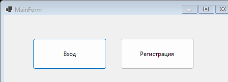

# lab2 — Login/register with a swappable data-access layer

One project: `Lab2` — WinForms, DI (`Microsoft.Extensions.DependencyInjection`), EF Core (SQLite).

`MainForm`, `LoginDialog`, and `RegisterDialog` authenticate against a `User` (login/password) table. Data access goes through `IDbWorker`, with three interchangeable implementations registered via DI — `RealDbWorker` (EF Core against SQLite), `FakeDbWorker`, and `ListDbWorker` — swappable without touching the forms.

**Tech stack:** C#, .NET 6.0, WinForms, EF Core, SQLite, DI
