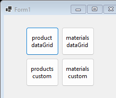

# lab3 — Materials/Products CRUD (WinForms)

One project: `Lab3` — WinForms, EF Core (SQLite).

CRUD over `Material`/`Product` entities via `Main`/`MaterialForm`/`ProductForm`, plus custom-drawn list controls (`MaterialView`, `ProductView`) and their own edit dialogs (`CustomMaterialForm`, `CustomProductForm`). Data access behind an `IDbWorker` abstraction, same pattern as `lab2`.

**Tech stack:** C#, .NET 6.0, WinForms, EF Core, SQLite

See also [`lab4/`](../lab4) — the WPF rebuild of this same domain.
