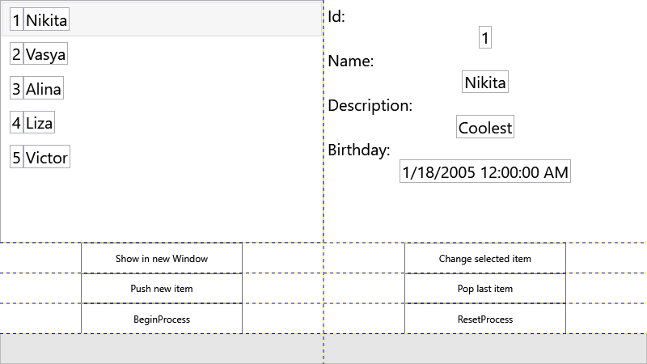

# lab6 — MVVM vs. plain data binding, side by side

One project: `Lab6` — WPF, EF Core (SQLite, currently commented out — runs against an in-memory list).

Two parallel implementations of the same "people" screen: `PersonModelSimple` (plain POCO) + `PeopleViewModelSimple` vs. `PersonModelMVVM` (implements `INotifyPropertyChanged`, so edits push to the UI automatically) + `PeopleViewModelMVVM`. `PeopleView.xaml` binds to whichever view model is set as its `DataContext`, making the difference directly observable.

**Tech stack:** C#, .NET 6.0, WPF, MVVM
